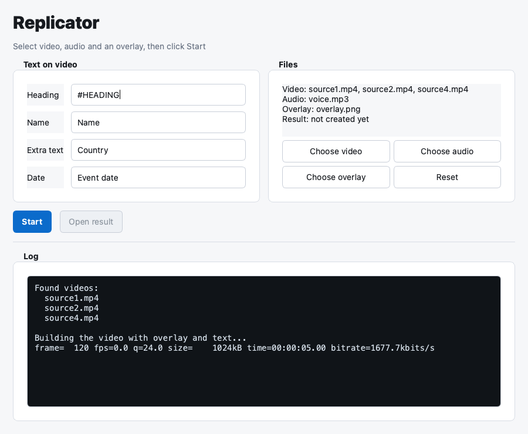

# Replicator

[](https://github.com/mmakarov/replicator/releases/latest)
[](https://github.com/mmakarov/replicator/releases)
[](LICENSE)
[](#requirements)
[](https://www.python.org/)

Replicator turns a set of clips into a single YouTube-ready MP4. It merges one
or more source videos, lays a transparent PNG overlay on top, draws four short
text fields, and adds an audio track. The video is looped automatically so the
final file has exactly the same length as the audio.



## Features

- **GUI and CLI**: a PySide6 desktop window for everyday use and a scriptable
  `replicator.py` command.
- **Automatic looping**: the concatenated video repeats until it covers the
  full audio track, then the audio is muxed in.
- **Transparent overlay**: any 1280x720 PNG overlay is composited over every
  frame.
- **Four text fields**: heading, name, extra line, and date, rendered with
  bundled Noto Sans fonts (including Cyrillic).
- **Portable Windows build**: a single `Replicator-Windows.zip` with embedded
  Python, Qt, ffmpeg, fonts, and sample media. No installation required.
- **Diagnostics**: startup and render errors are written to `startup.log` and
  `render.log` next to the launcher.

## Quick start (Windows)

1. Download `Replicator-Windows.zip` from the
   [latest release](https://github.com/mmakarov/replicator/releases/latest).
2. Unzip it anywhere.
3. Double-click `run-windows.bat`.
4. Choose one or more videos, one audio file, and optionally a different PNG
   overlay.
5. Fill in the four text fields and click **Start**.
6. The result appears next to the app as `youtube_ready.mp4`.

The archive already contains Python, Qt, ffmpeg, and fonts, so nothing else
needs to be installed.

## Sample files

The Windows package ships with sample inputs that are selected on startup:

- `video/source1.mp4`, `video/source2.mp4`, `video/source4.mp4`
- `audio/voice.mp3`
- `overlay.png`

## How it works

```text
source videos --> scale + crop to 1280x720 --> concat --+
                                                        +--> overlay + drawtext --> medium.mp4
overlay.png --------------------------------------------+

medium.mp4 --> loop to match audio length --> mux audio --> youtube_ready.mp4
```

1. Each source is scaled and cropped to 1280x720, then all clips are
   concatenated.
2. The overlay and the four text fields are drawn on the combined video.
3. The intermediate video is looped with `ffmpeg -stream_loop` and muxed with
   the audio track, trimming the result to the shorter stream.

## Developer setup

### Requirements

- Python 3.9 or newer.
- [ffmpeg](https://ffmpeg.org/) and `ffprobe` on `PATH`, or in a local `bin/`
  folder.
- `PySide6-Essentials` for the GUI.

```bash
python3 -m venv .venv
source .venv/bin/activate        # Windows: .venv\Scripts\activate
pip install PySide6-Essentials
```

Create your own inputs in `video/` (named `source1.mp4`, `source2.mp4`, ...),
`audio/voice.mp3`, and `overlay.png`, or use the samples committed to the
repository.

### GUI

```bash
python3 gui_qt.py
```

### CLI

```bash
python3 replicator.py \
  --heading "#EVENT" \
  --name "Jane Doe" \
  --extra "Sample City" \
  --date "2026-06-19" \
  --audio audio/voice.mp3 \
  --overlay overlay.png \
  --video video/source1.mp4 \
  --video video/source2.mp4
```

Use `--no-pause` to skip the final "press Enter" prompt (used by the release
smoke tests). Without the text arguments, the CLI prompts for each field.

## Project structure

| Path | Purpose |
| --- | --- |
| `replicator.py` | Rendering pipeline and CLI. |
| `gui_qt.py` | PySide6 desktop interface. |
| `launcher.py` | Entry point for the portable Windows package. |
| `run-windows.bat` | Starts the packaged app on Windows. |
| `source-to-fin.py`, `source-to-fin-win.py` | Legacy MoviePy scripts, kept for reference. |
| `fonts/` | Bundled Noto Sans fonts. |
| `docs/` | Screenshots and documentation assets. |
| `.github/workflows/` | Windows build/release and smoke-test workflows. |

## Building and releasing

The GitHub Actions workflow **Build Windows release** builds, smoke-tests, and
publishes the portable package.

1. Open **Actions**, then **Build Windows release**.
2. Click **Run workflow**.
3. Enter a new tag, for example `v8`.

The workflow runs on `windows-latest`, downloads embedded Python, PySide6,
shiboken6, and ffmpeg, produces `dist/Replicator-Windows.zip`, runs the smoke
tests against the built package, and only then creates the GitHub Release. The
separate **Windows release smoke** workflow can test an already published
archive by URL.

## Troubleshooting

- **Nothing happens / app closes**: check `startup.log` next to
  `run-windows.bat`.
- **Render fails**: check `render.log`; it contains the full `ffmpeg` output.
- **`ffmpeg` not found**: install ffmpeg and make sure it is on `PATH`, or
  place `ffmpeg`/`ffprobe` in a local `bin/` folder.
- **Not enough disk space**: the app needs room for the intermediate video, the
  looped copy, and the final file; free several gigabytes before rendering.
- **Text is missing or garbled**: keep the bundled `fonts/` folder next to the
  scripts; it provides Cyrillic coverage.

## Legacy scripts

`source-to-fin.py`, `source-to-fin-win.py`, and `requirements.txt` belong to the
original MoviePy-based implementation. They are kept for reference only and are
not used by the current `replicator.py` / `gui_qt.py` path.

## Contributing

Contributions are welcome. See [CONTRIBUTING.md](CONTRIBUTING.md) for the
development setup and pull request process. This project follows the
[Contributor Covenant](CODE_OF_CONDUCT.md) code of conduct.

## License

Released under the [MIT License](LICENSE).
